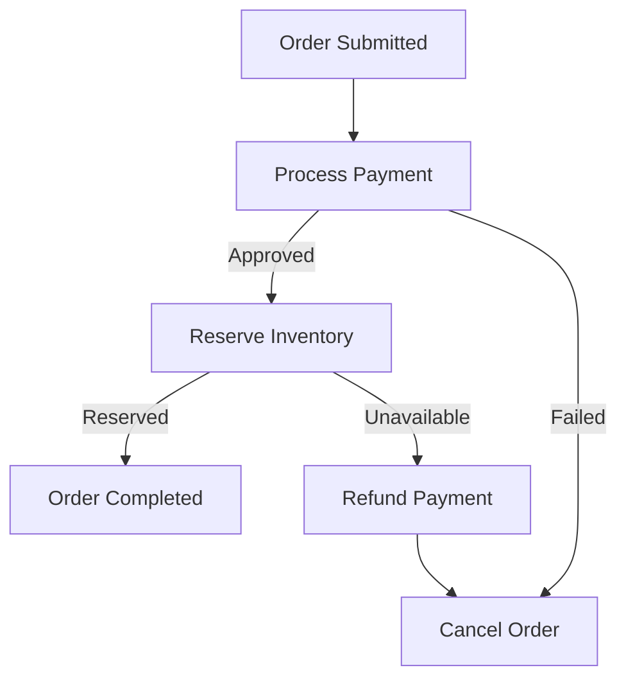

# SagaFlow Project

A distributed event-driven saga orchestrator system built with .NET 9, MassTransit, RabbitMQ, and PostgreSQL.

## Overview

SagaFlow demonstrates a robust implementation of the **Saga Pattern** for managing distributed transactions across microservices using event-driven architecture. The system coordinates order processing, payment handling, and inventory management with automatic compensating transactions on failures.

## Architecture

### Technology Stack

- **.NET 9** with C# 13 features (Primary Constructors, File-scoped namespaces)
- **MassTransit** - State machine and message bus orchestration
- **RabbitMQ** - Message broker for asynchronous communication
- **PostgreSQL** - Saga state persistence with Entity Framework Core
- **Docker Compose** - Container orchestration for infrastructure

### Project Structure

```
SagaFlow/
├── src/
│   ├── SagaFlow.Contracts/          # Shared messages (Events & Commands)
│   ├── SagaFlow.Infrastructure/      # Common infrastructure setup
│   ├── SagaFlow.OrderService/        # Web API hosting the Saga State Machine
│   ├── SagaFlow.PaymentService/      # Worker service for payment processing
│   └── SagaFlow.InventoryService/    # Worker service for stock reservation
├── docker-compose.yml                # Infrastructure services
└── README.md
```

### Saga Workflow



**States:**
1. **OrderSubmitted** → Start Saga
2. Saga sends **ProcessPayment** command
   - **PaymentApproved** → Continue
   - **PaymentFailed** → Cancel Order
3. Saga sends **ReserveInventory** command
   - **InventoryReserved** → Complete Order
   - **StockUnavailable** → **Compensating Transaction**
     - Send **RefundPayment** command
     - Publish **OrderCancelled** event

## Key Features

### 1. Event-Driven Saga Pattern
- **OrderStateMachine** coordinates distributed workflow
- State persistence in PostgreSQL for durability
- Automatic state transitions based on events

### 2. Compensating Transactions
- Automatic refund on stock unavailability
- Graceful failure handling with order cancellation
- Maintains data consistency across services

### 3. Resiliency
- **Exponential backoff retry policy** (5 retries, 2-30 seconds)
- **Delayed redelivery** (3 retries, 5-60 seconds)
- Message durability with RabbitMQ

### 4. Observability
- Health checks for RabbitMQ and PostgreSQL
- Structured logging for all services
- Message tracing through correlation IDs

## Getting Started

### Prerequisites

- [.NET 9 SDK](https://dotnet.microsoft.com/download/dotnet/9.0)
- [Docker Desktop](https://www.docker.com/products/docker-desktop)

### Infrastructure Setup

Start RabbitMQ and PostgreSQL:

```bash
docker-compose up -d
```

**Services:**
- RabbitMQ: http://localhost:15672 (guest/guest)
- PostgreSQL: localhost:5432 (postgres/postgres)

### Database Migration

Apply migrations to create the saga state tables:

```bash
cd src/SagaFlow.OrderService
dotnet ef database update
```

### Running the Application

Open 3 terminal windows and run:

**Terminal 1 - Order Service (Web API):**
```bash
cd src/SagaFlow.OrderService
dotnet run
```

**Terminal 2 - Payment Service:**
```bash
cd src/SagaFlow.PaymentService
dotnet run
```

**Terminal 3 - Inventory Service:**
```bash
cd src/SagaFlow.InventoryService
dotnet run
```

### Testing the Saga

Submit an order via HTTP POST:

```bash
curl -X POST http://localhost:5000/api/orders \
  -H "Content-Type: application/json" \
  -d '{
    "customerId": "CUST-001",
    "totalAmount": 199.99,
    "items": [
      {
        "productId": "PROD-123",
        "quantity": 2,
        "price": 99.99
      }
    ]
  }'
```

**Response:**
```json
{
  "orderId": "3fa85f64-5717-4562-b3fc-2c963f66afa6",
  "message": "Order submitted successfully"
}
```

### Health Checks

Check service health:
```bash
curl http://localhost:5000/health
```

## Messages (Contracts)

### Events
- `OrderSubmitted` - New order created
- `PaymentApproved` - Payment succeeded
- `PaymentFailed` - Payment declined
- `InventoryReserved` - Stock reserved
- `StockUnavailable` - Out of stock
- `PaymentRefunded` - Refund processed
- `OrderCompleted` - Order finalized
- `OrderCancelled` - Order cancelled

### Commands
- `ProcessPayment` - Process payment request
- `ReserveInventory` - Reserve stock
- `RefundPayment` - Issue refund
- `CancelOrder` - Cancel order

## Configuration

### Connection Strings

Edit `appsettings.json` in each service:

```json
{
  "ConnectionStrings": {
    "SagaDb": "Host=localhost;Port=5432;Database=sagaflow;Username=postgres;Password=postgres"
  },
  "RabbitMq": {
    "Host": "localhost",
    "Username": "guest",
    "Password": "guest"
  }
}
```

## Code Highlights

### Saga State Machine (Simplified)

```csharp
Initially(
    When(OrderSubmittedEvent)
        .Send(context => new ProcessPayment(...))
        .TransitionTo(ProcessingPayment));

During(ProcessingPayment,
    When(PaymentApprovedEvent)
        .Send(context => new ReserveInventory(...))
        .TransitionTo(ReservingInventory));

During(ReservingInventory,
    When(StockUnavailableEvent)
        .Send(context => new RefundPayment(...))
        .TransitionTo(Compensating));
```

### Consumer Example

```csharp
public class ProcessPaymentConsumer(ILogger<ProcessPaymentConsumer> logger) 
    : IConsumer<ProcessPayment>
{
    public async Task Consume(ConsumeContext<ProcessPayment> context)
    {
        // Process payment logic
        await context.Publish(new PaymentApproved(...));
    }
}
```

## Development

### Build Solution
```bash
dotnet build
```

### Run Tests (if available)
```bash
dotnet test
```

### Create New Migration
```bash
cd src/SagaFlow.OrderService
dotnet ef migrations add <MigrationName>
```

## Clean Architecture Principles

- **Separation of Concerns**: Each service has distinct responsibilities
- **Dependency Inversion**: Services depend on contracts (abstractions)
- **Single Responsibility**: One service, one bounded context
- **Scalability**: Each service can be scaled independently

## License

MIT License - See LICENSE file for details

## Contributing

Contributions are welcome! Please open an issue or submit a pull request.

## Contact

For questions or support, please create an issue in the GitHub repository.
